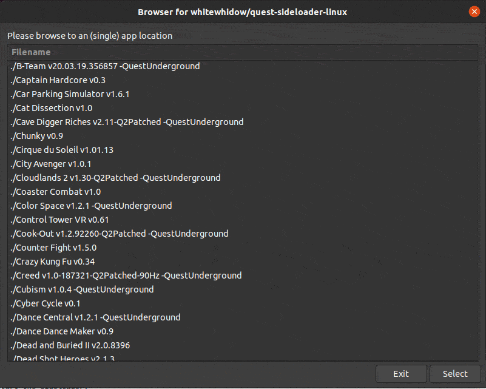

# Quest-sideloader
Quest(1/2) sideloader for linux , mac and Windows(WSL1).


UPDATE: 22/10/2020: Browser GUI added!

UPDATE: 22/10/2020: Sideload from ftp supported!

# Try the one-liner first, no install required (CLI only, no gui)!
Run from inside any 'app-folder' folder containing an apk, and optional OBB file(s).
```bash
curl https://raw.githubusercontent.com/whitewhidow/quest-sideloader-linux/main/sideload.sh > sideload.sh && chmod +x ./sideload.sh && sudo ./sideload.sh
```
<!--
Last stable build for one-liner: 
```bash
curl https://raw.githubusercontent.com/whitewhidow/quest-sideloader-linux/v2.2/sideload.sh > sideload.sh && chmod +x ./sideload.sh && sudo ./sideload.sh
```

<!--  -->

# Global Installation (LINUX & MAC)
1. Download the project:
<!--
Last stable build: 
```bash
https://github.com/whitewhidow/quest-sideloader-linux/archive/v2.2.zip
```

Most recent build: 
-->

```bash
https://github.com/whitewhidow/quest-sideloader-linux/archive/main.zip
```
2. Unzip the archive and navigate to the folder:
```
unzip quest-sideloader-linux-main.zip && cd quest-sideloader-linux-main
```
3. Copy the files to your $PATH: 
```
sudo cp ./sideload.sh /usr/local/bin/sideload
sudo cp ./sideload-gui.sh /usr/local/bin/sideload-gui
```

### One-Time Prerequisites (LINUX OPTIONAL)

If your current linux need a special udev rule to allow permissions the adb device, run the following command to add them easely:
```
sudo ./extras/udev.sh $USER
```
   
   
## USAGE:
Once globally installed, simply run from anywhere on your system
```
sideload-gui
```

   
   

## Ready to Sideload an apk!

Now run `sideload-gui` to use an easy to use file-browser
OR
Now run `sideload` directly from any 'app-folder' folder containing an apk, and optional OBB file(s).
Then just follow the on screen prompts:


Please feel free to ask for help when encountering any issues.


 Copyright (c) 2020 WhiteWhidow/branchBit

 Permission is hereby granted, free of charge, to any person
 obtaining a copy of this software and associated documentation
 files (the "Software"), to deal in the Software without
 restriction, including without limitation the rights to use,
 copy, modify, merge, publish, distribute, sublicense, and/or sell
 copies of the Software, and to permit persons to whom the
 Software is furnished to do so, subject to the following
 conditions:

 The above copyright notice and this permission notice shall be
 included in all copies or substantial portions of the Software.

 THE SOFTWARE IS PROVIDED "AS IS", WITHOUT WARRANTY OF ANY KIND,
 EXPRESS OR IMPLIED, INCLUDING BUT NOT LIMITED TO THE WARRANTIES
 OF MERCHANTABILITY, FITNESS FOR A PARTICULAR PURPOSE AND
 NONINFRINGEMENT. IN NO EVENT SHALL THE AUTHORS OR COPYRIGHT
 HOLDERS BE LIABLE FOR ANY CLAIM, DAMAGES OR OTHER LIABILITY,
 WHETHER IN AN ACTION OF CONTRACT, TORT OR OTHERWISE, ARISING
 FROM, OUT OF OR IN CONNECTION WITH THE SOFTWARE OR THE USE OR
 OTHER DEALINGS IN THE SOFTWARE.
