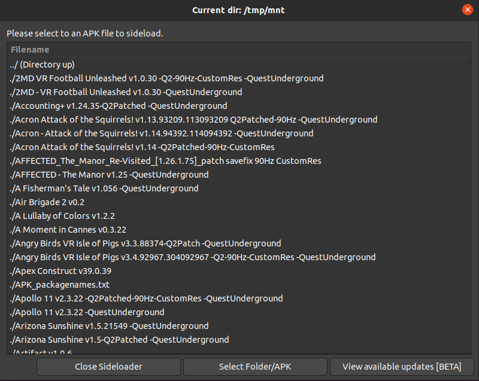

# Quest-sideloader-linux (& mac osx)
Quest Sideloader for Linux and Mac with integrated drive access to app library.

Branch | Linux | OSX Catalina | OSX Big-Sur
------------ | ------------- | ------------ | -------------
main | [](https://github.com/whitewhidow/quest-sideloader-linux/actions?query=workflow%3ACI-LINUX) | [](https://github.com/whitewhidow/quest-sideloader-linux/actions?query=workflow%3ACI-CATALINA-BARE) | [](https://github.com/whitewhidow/quest-sideloader-linux/actions?query=workflow%3ACI-BIG-SUR)
development |  |  | 

<!--
<details>
<summary>Changelog (last update 01/11/2020)</summary>
  
```
UPDATE: 22/10/2020: Grapchical Browser added!
UPDATE: 22/10/2020: Support for sideloading content straight from a mounted drive!
UPDATE: 25/10/2020: Install script added, no more manual dependency installs required!
UPDATE: 26/10/2020: Integrated drive access to app library!
UPDATE: 27/10/2020: Streamlined (re)install process and better libs install for linux!
UPDATE: 29/10/2020: All inputs and choices now performed trough gui
UPDATE: 31/10/2020: Many OSX FIXES
UPDATE: 31/10/2020: Changed to zenity list instead of native dir-browser(was stupid slow on mac)
UPDATE: 01/11/2020: Mac osx install better error reporting
UPDATE: 01/11/2020: "Check for updates in drive" feature[BETA] Added
UPDATE: 03/11/2020: Gui now lists newest added items on top
UPDATE: 04/11/2020: Able to change device settings without sideloading

```
</details> 
-->
# Install / Update:
Latest Stable: 
```
curl -fsSL https://raw.githubusercontent.com/whitewhidow/quest-sideloader-linux/main/install | /bin/bash -s -- main
```
Latest Dev: 
```
curl -fsSL https://raw.githubusercontent.com/whitewhidow/quest-sideloader-linux/development/install | /bin/bash -s -- development
```


# Usage:
```
sideload-gui
```
# Extra:
<!--
<details>
<summary>NEW: "Check for updates in drive" feature [BETA]:</summary>


</details>  
<details>
<summary>General screenshots:</summary>





</details>  
<details>
<summary>Username change and global 90hz support:</summary>


</details>  

<details>
<summary>Support for "90HzCustomRes" Releases:</summary>


</details>  
-->
<details>
<summary>Linux udev rules?</summary>

In case your distro need a special udev rule to allow permissions to the adb device:
```
sudo ./extras/udev.sh $USER
```
</details>  


Please feel free to ask for help when encountering any issues.

Looking for content or support? Find me @ https://t.me/whitewhidow_q2_working

 Copyright (c) 2020 WhiteWhidow/branchBit

 Permission is hereby granted, free of charge, to any person
 obtaining a copy of this software and associated documentation
 files (the "Software"), to deal in the Software without
 restriction, including without limitation the rights to use,
 copy, modify, merge, publish, distribute, sublicense, and/or sell
 copies of the Software, and to permit persons to whom the
 Software is furnished to do so, subject to the following
 conditions:

 The above copyright notice and this permission notice shall be
 included in all copies or substantial portions of the Software.

 THE SOFTWARE IS PROVIDED "AS IS", WITHOUT WARRANTY OF ANY KIND,
 EXPRESS OR IMPLIED, INCLUDING BUT NOT LIMITED TO THE WARRANTIES
 OF MERCHANTABILITY, FITNESS FOR A PARTICULAR PURPOSE AND
 NONINFRINGEMENT. IN NO EVENT SHALL THE AUTHORS OR COPYRIGHT
 HOLDERS BE LIABLE FOR ANY CLAIM, DAMAGES OR OTHER LIABILITY,
 WHETHER IN AN ACTION OF CONTRACT, TORT OR OTHERWISE, ARISING
 FROM, OUT OF OR IN CONNECTION WITH THE SOFTWARE OR THE USE OR
 OTHER DEALINGS IN THE SOFTWARE.
